# Fish-Commerce 🐟

基于 **Spring Cloud Alibaba** 的水产品垂直电商平台，采用前后端分离的微服务架构，支持 **Docker 一键部署**。

> 🌐 技术栈：Spring Boot 3 + Spring Cloud 2023 + Vue 3 + Nacos + MySQL + Redis + RabbitMQ + Nginx

## 系统功能架构图

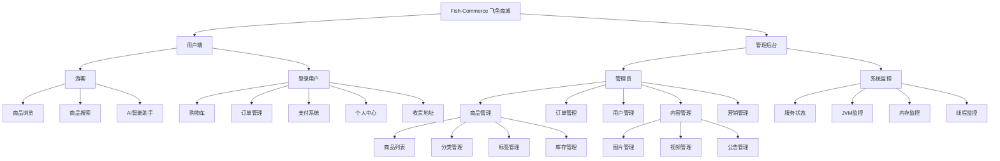

## 技术栈

### 后端

| 技术 | 版本 | 说明 |
|------|------|------|
| Java | 17 | 开发语言 |
| Spring Boot | 3.3.4 | 基础框架 |
| Spring Cloud | 2023.0.3 | 微服务框架 |
| Spring Cloud Alibaba | 2023.0.3.2 | 微服务增强组件 |
| Nacos | 2.4.3 | 服务注册与配置中心 |
| MyBatis-Plus | 3.5.5 | ORM 框架 |
| MySQL | 8.0 | 关系型数据库 |
| Redis | 6.0+ | 缓存与限流 |
| RabbitMQ | 3.x | 异步消息队列 |
| Sentinel | - | 熔断降级 |
| OpenFeign | - | 服务间调用 |
| Spring Boot Admin | 3.3.4 | 服务监控 |

### 前端

| 技术 | 版本 | 说明 |
|------|------|------|
| Vue | 3.5.29 | 前端框架 |
| Vue Router | 4.6.4 | 路由管理 |
| Element Plus | 2.13.5 | UI 组件库 |
| Axios | 1.7.0 | HTTP 请求 |
| Vite | 7.3.1 | 构建工具 |
| Marked | 17.0.5 | Markdown 渲染（AI 对话） |

## 项目结构

```
Fish-Commerce/
├── gateway/             # API 网关（端口 5000）
├── monitor/             # 系统监控（端口 8080，Spring Boot Admin）
├── model/               # 公共实体与 DTO 模块
├── service/
│   ├── service-user/    # 用户服务（端口 7000）
│   ├── service-product/ # 商品服务（端口 9000）
│   ├── service-order/   # 订单服务（端口 8000）
│   ├── service-cart/    # 购物车服务（端口 7500）
│   ├── service-pay/     # 支付服务（端口 8500）
│   ├── service-content/ # 内容服务（端口 9200）
│   └── service-ai/      # AI 智能服务（端口 9100，DeepSeek）
├── web-page/            # 前端项目（Vue 3）
├── docker/              # Docker 配置（Dockerfile、Nginx）
├── sql/                 # 数据库脚本
├── uploads/             # 文件上传目录
├── docker-compose.yml   # Docker Compose 编排文件
├── build.ps1            # 一键构建部署脚本
└── pom.xml              # 父 POM
```

## 系统架构

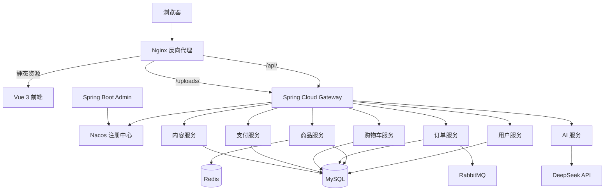

## 功能模块

| 模块 | 功能 |
|------|------|
| 用户体系 | 注册、登录、个人信息管理、收货地址管理、VIP 会员 |
| 商品体系 | 商品浏览、搜索、分类管理、标签管理、库存管理、上下架 |
| 订单体系 | 创建订单、支付、确认、发货、取消、查询 |
| 购物车 | 添加、修改数量、删除、批量操作、清空 |
| 支付体系 | 创建支付、支付确认、支付取消、支付查询 |
| 内容管理 | 公告管理、图库管理、视频管理 |
| AI 智能服务 | 智能对话、流式响应 |
| 系统监控 | 系统信息、内存监控、线程监控、CPU 监控 |
| 管理员后台 | 数据统计、用户/商品/订单管理、公告/图库/视频审核 |

## 数据库设计

数据库采用 MySQL 8.0，字符集 `utf8mb4`，按业务拆分为 8 个独立数据库：

### fish_user（用户库）

| 表名 | 说明 | 关键字段 |
|------|------|----------|
| `user` | 用户表 | username, password, nickname, email, phone, gender, avatar, birthday, level, vip_expire_time, status, role |
| `address` | 收货地址表 | user_id, receiver_name, receiver_phone, province, city, district, detail, is_default |
| `user_coupon` | 用户优惠券表 | user_id, coupon_id, status, receive_time, use_time, order_id |

### fish_product（商品库）

| 表名 | 说明 | 关键字段 |
|------|------|----------|
| `product` | 商品表 | name, description, category_id, price, original_price, stock, sales, main_image, specs, origin, weight, shelf_life, storage, status, detail_images, detail, is_banner, banner_sort |
| `category` | 商品分类表 | name, icon, sort, status |
| `tag` | 商品标签表 | name, color |
| `product_tag` | 商品标签关联表 | product_id, tag_id |
| `review` | 商品评论表 | product_id, user_id, username, rating, content |
| `specification` | 商品规格表 | name, value, sort_order |
| `spec_group` | 规格组表 | name, sort_order, status |
| `spec_value` | 规格值表 | group_id, value, sort_order |
| `coupon` | 优惠券表 | name, type, value, min_amount, total_count, received_count, limit_per_user, start_time, end_time, status, product_ids, member_levels |
| `gallery_image` | 图库图片表 | filename, original_name, url, size, mime_type, remark |
| `notice` | 公告表 | title, content, type, status, sort_order, start_time, end_time |

### fish_order（订单库）

| 表名 | 说明 | 关键字段 |
|------|------|----------|
| `order` | 订单表 | order_no, user_id, receiver_name, receiver_phone, receiver_address, total_amount, freight, pay_amount, pay_type, pay_time, status, remark |
| `order_item` | 订单明细表 | order_id, product_id, product_name, product_image, product_spec, price, quantity, total_amount |

### fish_cart（购物车库）

| 表名 | 说明 | 关键字段 |
|------|------|----------|
| `cart` | 购物车表 | user_id, product_id, product_name, product_image, product_spec, price, quantity, selected |

### fish_pay（支付库）

| 表名 | 说明 | 关键字段 |
|------|------|----------|
| `payment` | 支付记录表 | order_id, order_no, user_id, pay_amount, pay_type, status, transaction_no, pay_time |

### fish_content（内容库）

| 表名 | 说明 | 关键字段 |
|------|------|----------|
| `gallery_image` | 图库图片表 | filename, original_name, url, size, mime_type, remark |
| `notice` | 公告表 | title, content, type, status, sort_order, start_time, end_time |
| `video` | 视频表 | title, filename, original_name, url, size, duration, mime_type, description, cover_url |

### fish_marketing（营销库）

| 表名 | 说明 | 关键字段 |
|------|------|----------|
| `coupon` | 优惠券表 | name, type, value, min_amount, total_count, received_count, limit_per_user, start_time, end_time, status, product_ids |

### fish_video（视频库）

| 表名 | 说明 | 关键字段 |
|------|------|----------|
| `video` | 视频管理表 | title, filename, original_name, url, size, duration, mime_type, description, cover_url |

## 环境要求

- **JDK** 17+
- **Maven** 3.6+（或使用内置的 Maven Wrapper）
- **Node.js** 20.19.0 或 22.12.0+
- **MySQL** 8.0+（字符集 utf8mb4）
- **Redis** 6.0+
- **RabbitMQ** 3.x
- **Nacos** 2.4.3
- **Docker**（可选，用于一键部署）

## 快速启动

### 方式一：Docker 一键部署（推荐）

仅需 Docker 环境，无需安装 JDK、MySQL 等依赖：

```bash
# 1. 克隆项目
git clone https://gitee.com/afishing/Fish-commerce.git
cd Fish-Commerce

# 2. 配置环境变量
cp .env.example .env
# 编辑 .env 设置 MySQL 密码和 DeepSeek API Key

# 3. 构建并启动（PowerShell）
.\build.ps1 build

# 或手动执行：
.\mvnw.cmd clean package -DskipTests     # 构建 Java 服务
docker-compose build                       # 构建 Docker 镜像
docker-compose up -d                       # 启动所有容器
```

启动完成后访问：

| 服务 | 地址 |
|------|------|
| 前端页面 | http://localhost:8888 |
| API 网关 | http://localhost:5000 |
| Nacos 控制台 | http://localhost:18848/nacos |
| RabbitMQ 管理台 | http://localhost:15672 |

**Docker 容器清单（共 14 个）：**

| 容器 | 镜像 | 说明 |
|------|------|------|
| fish-mysql | mysql:8.0 | 数据库（自动初始化 8 个库） |
| fish-redis | redis:6-alpine | 缓存 |
| fish-rabbitmq | rabbitmq:3-management | 消息队列 |
| fish-nacos | nacos-server:v2.4.3-slim | 注册中心 |
| fish-gateway | 自构建 | API 网关 |
| fish-service-user | 自构建 | 用户服务 |
| fish-service-product | 自构建 | 商品服务 |
| fish-service-order | 自构建 | 订单服务 |
| fish-service-cart | 自构建 | 购物车服务 |
| fish-service-pay | 自构建 | 支付服务 |
| fish-service-content | 自构建 | 内容服务 |
| fish-service-ai | 自构建 | AI 智能服务 |
| fish-monitor | 自构建 | 系统监控 |
| fish-nginx | nginx:alpine | 前端 + 反向代理 |

```bash
# 常用运维命令
docker-compose logs -f gateway       # 查看网关日志
docker-compose restart service-product  # 重启单个服务
docker-compose down                  # 停止所有容器
.\build.ps1 logs                     # 查看所有日志
.\build.ps1 clean                    # 清理容器和镜像
```

### 方式二：本地开发启动

#### 1. 初始化数据库

```bash
mysql -u root -p < sql/init.sql
```

#### 2. 启动基础设施

按以下顺序启动中间件：

1. **Nacos**（http://127.0.0.1:8848）
2. **MySQL**、**Redis**、**RabbitMQ**

#### 3. 启动后端服务

按以下推荐顺序依次启动微服务：

```
service-user → service-product → service-order → service-cart
→ service-pay → service-content → service-ai → monitor → gateway
```

#### 4. 启动前端

```bash
cd web-page
npm install
npm run dev
```

## 服务端口一览

| 服务 | 端口 |
|------|------|
| Gateway（API 网关） | 5000 |
| service-user | 7000 |
| service-cart | 7500 |
| service-order | 8000 |
| Monitor（系统监控） | 8080 |
| service-pay | 8500 |
| service-product | 9000 |
| service-ai | 9100 |
| service-content | 9200 |
| Nacos | 8848 |
| RabbitMQ | 5672 |
| Redis | 6379 |

## 界面预览

### 用户端

| 首页 | AI 智能助手 | 商品列表 |
|------|------------|----------|
| 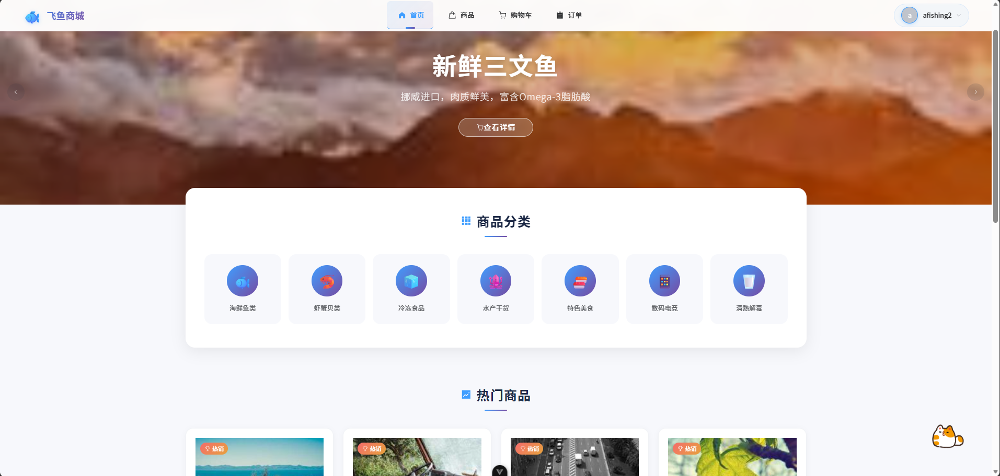 | 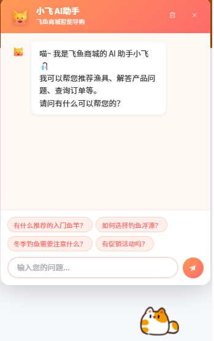 | 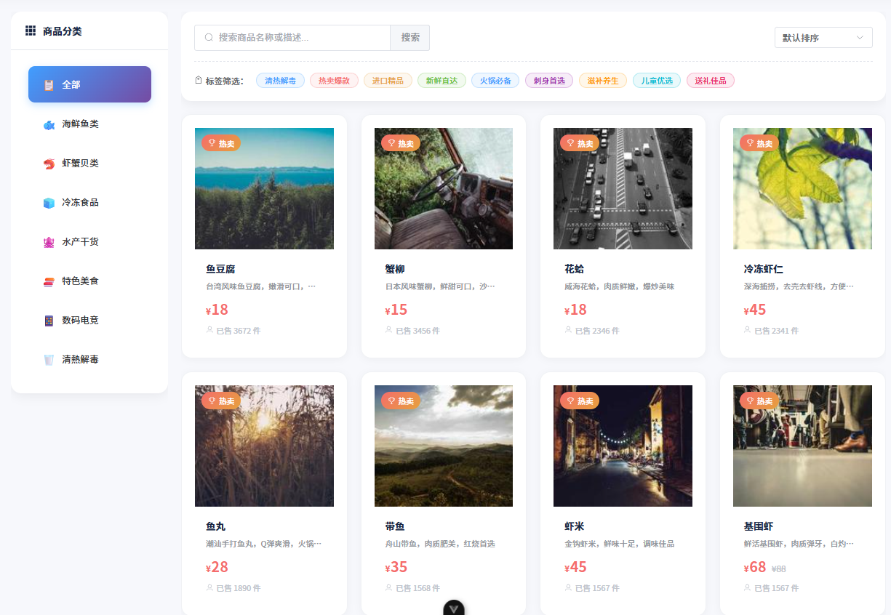 |

| 购物车 | 商品详情 | 订单确认 |
|--------|----------|----------|
| 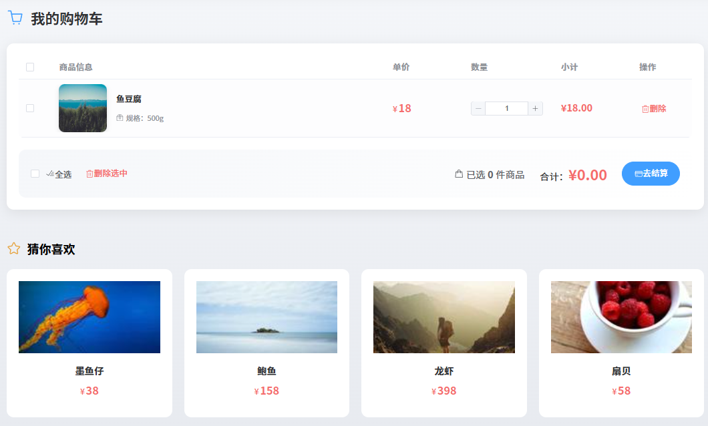 | 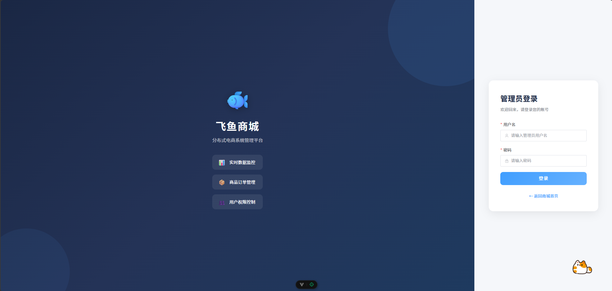 | 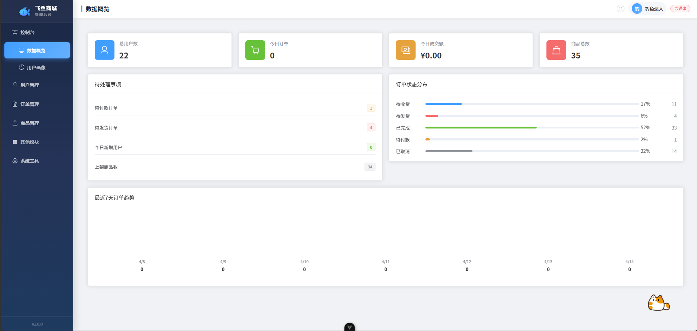 |

### 管理后台

| 数据概览 | 用户画像 | 用户列表 |
|----------|----------|----------|
| 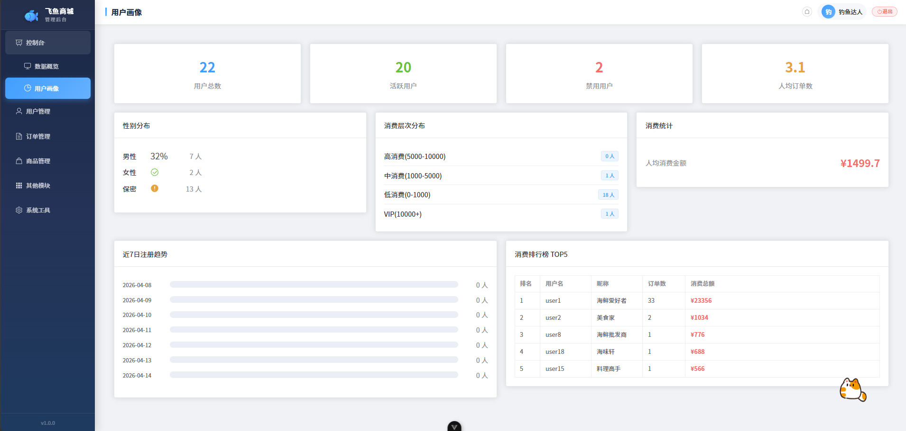 | 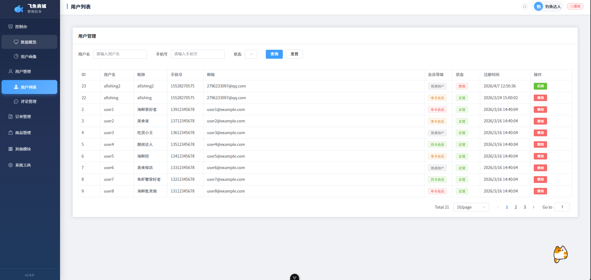 | 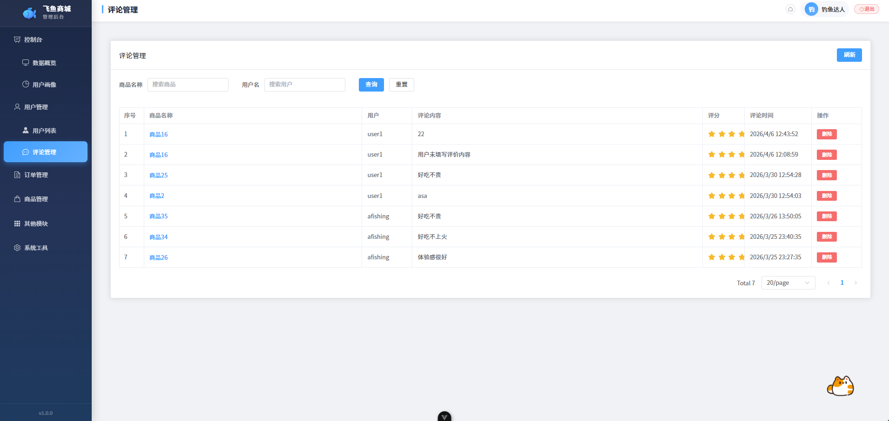 |

| 评论管理 | 订单管理 | 商品管理 |
|----------|----------|----------|
| 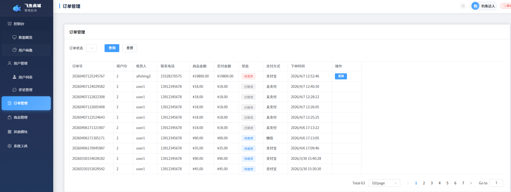 | 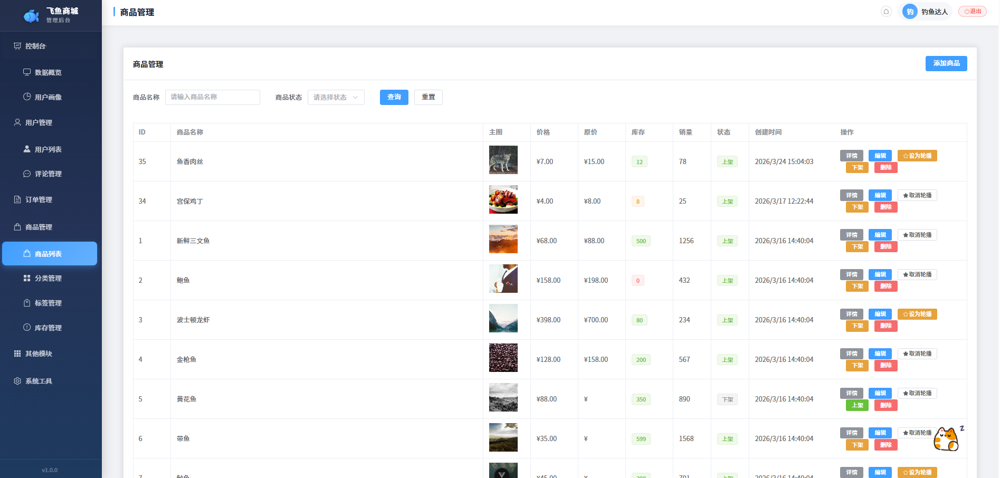 | 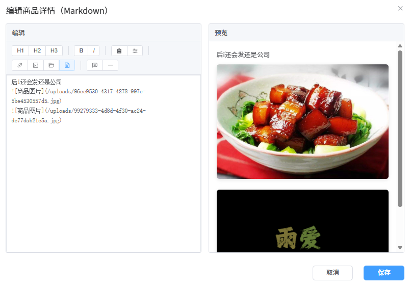 |

| 商品详情编辑 | 分类管理 | 标签管理 |
|--------------|----------|----------|
| 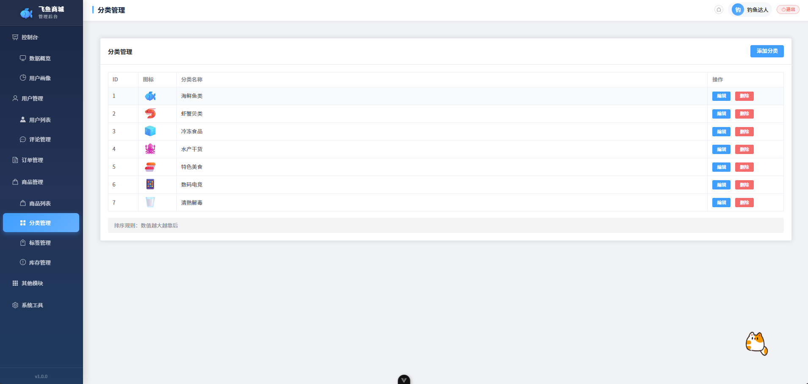 | 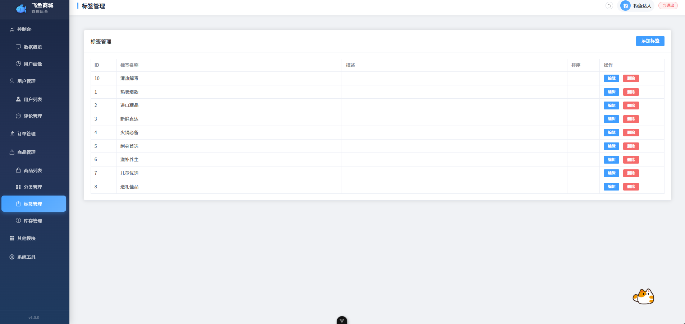 | 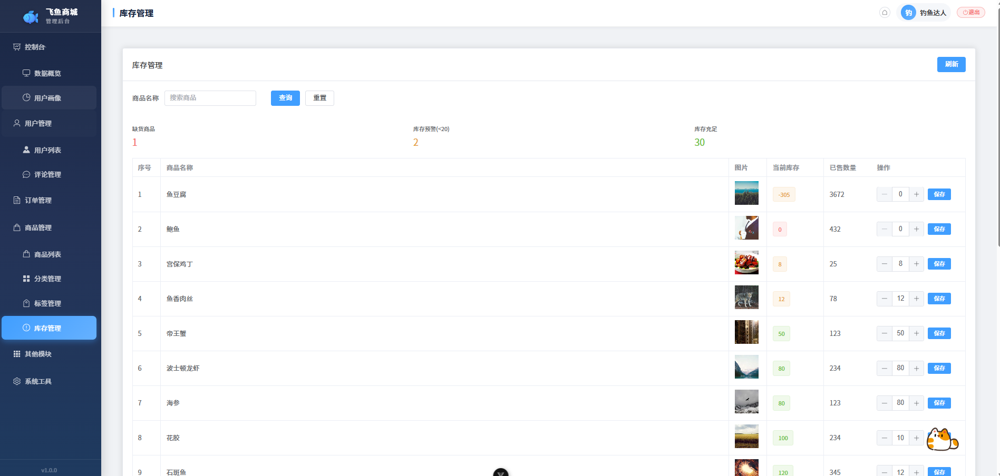 |

| 库存管理 | 图片管理 | 视频管理 |
|----------|----------|----------|
| 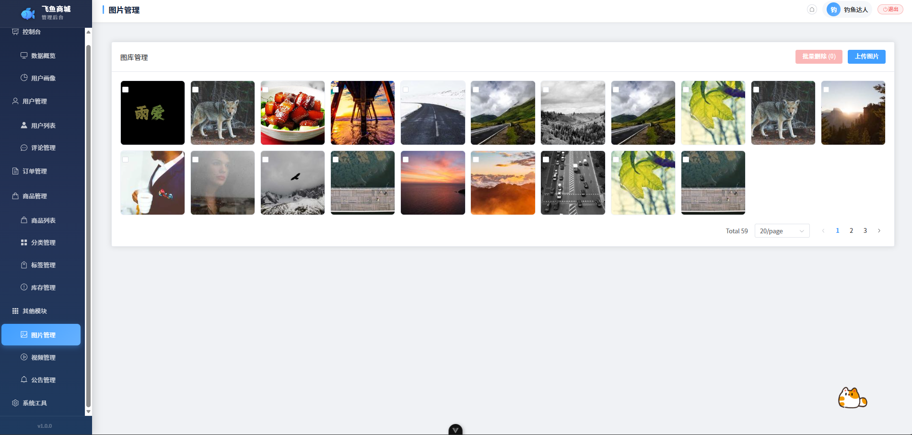 | 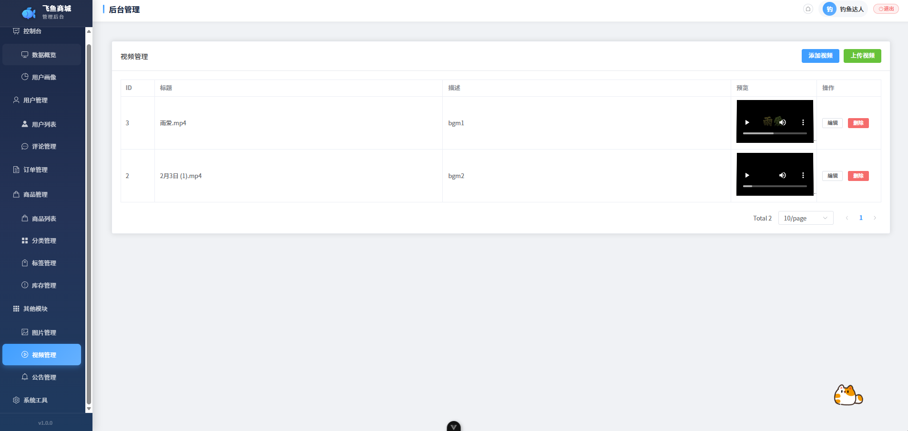 | 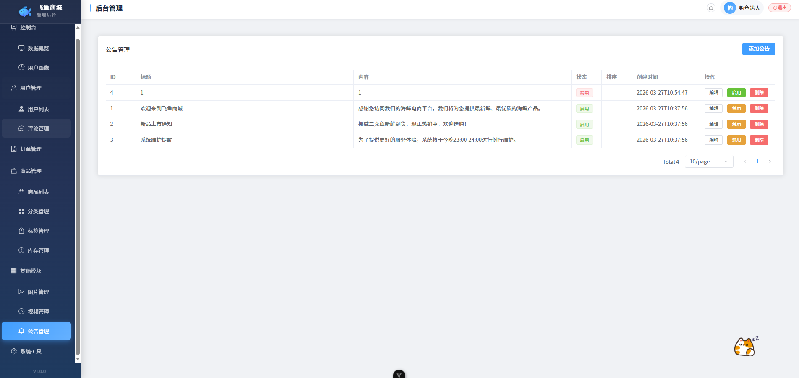 |

| 公告管理 | 系统监控 | 服务详情 |
|----------|----------|----------|
| 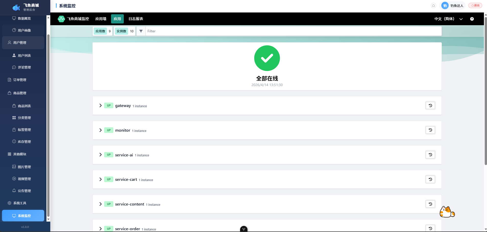 | 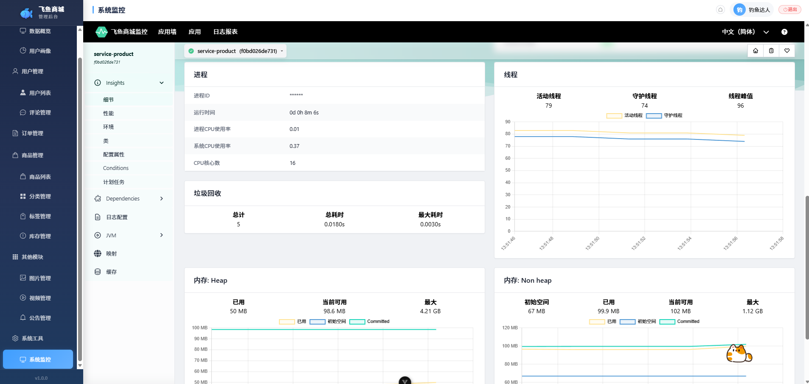 |  |

## 开发规范

- 遵循阿里巴巴 Java 开发手册
- RESTful API 设计
- 数据库表名使用单数命名（如 `order` 而非 `orders`）
- 前端使用 Vue 3 组合式 API + Element Plus

## License

MIT
