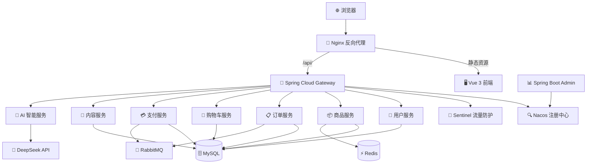
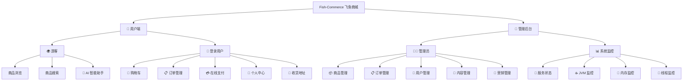

<div align="center">

# 🐟 Fish-Commerce · 飞鱼商城

**一款基于 Spring Cloud Alibaba 微服务架构的分布式电商系统**

集成 DeepSeek AI 智能客服 · 高并发 · 高可用 · 弹性扩展

[](https://spring.io/projects/spring-boot)
[](https://spring.io/projects/spring-cloud)
[](https://sca.aliyun.com/)
[](https://vuejs.org/)
[](https://openjdk.org/)
[](https://docs.docker.com/compose/)
[](LICENSE)

</div>

---

## ✨ 项目亮点

| 亮点 | 说明 |
|:---:|------|
| 🤖 **AI 智能客服** | 集成 DeepSeek 大模型 API，支持自然语言问答、上下文多轮对话、**SSE 流式响应**，提升用户交互体验 |
| 📦 **微服务架构** | 基于 Spring Cloud Alibaba，服务拆分清晰（用户 / 商品 / 订单 / 购物车 / 支付 / 内容 / AI），**7 大业务服务独立部署** |
| 🔍 **服务治理** | Nacos 实现服务注册、发现与配置管理，支持**动态配置热更新**与多环境隔离 |
| 🚦 **流量防护** | Sentinel 实现接口级限流、熔断降级，保障系统在高并发下的**高可用性** |
| 🧭 **API 网关** | Spring Cloud Gateway 统一路由转发，集成 **JWT 鉴权**与全局跨域处理 |
| 💬 **服务通信** | OpenFeign + LoadBalancer 声明式服务间调用与**客户端负载均衡** |
| ⚡ **高性能缓存** | Redis 实现热卖商品缓存、购物车数据缓存、订单超时自动取消 |
| 📨 **异步解耦** | RabbitMQ 处理订单支付完成事件，**削峰填谷**提升系统吞吐量 |
| 📊 **系统监控** | Spring Boot Admin 实时监控各微服务健康状态、JVM、线程与内存 |
| 🐳 **一键部署** | Docker Compose 编排 14 个容器，**一条命令启动整个系统** |

---

## 🏗️ 系统架构



---

## 🛠️ 技术栈

### 🔧 后端技术

| 技术 | 版本 | 说明 |
|:---:|:---:|------|
| ☕ Java | 17 | 开发语言 |
| 🍃 Spring Boot | 3.3.4 | 应用基础框架 |
| ☁️ Spring Cloud | 2023.0.3 | 微服务治理框架 |
| 🌩️ Spring Cloud Alibaba | 2023.0.3.2 | 分布式增强组件（Nacos / Sentinel） |
| 🧭 Spring Cloud Gateway | - | API 网关 · 路由转发 · JWT 鉴权 |
| 🔍 Nacos | 2.4.3 | 服务注册发现 · 配置中心 |
| 🚦 Sentinel | - | 流量控制 · 熔断降级 |
| 💬 OpenFeign | - | 声明式服务间调用 |
| ⚖️ LoadBalancer | - | 客户端负载均衡 |
| 🗄️ MySQL | 8.0 | 关系型数据库（8 库分库设计） |
| ⚡ Redis | 6.0+ | 高性能缓存 · 分布式锁 |
| 📨 RabbitMQ | 3.x | 异步消息队列 · 事件驱动 |
| 🔗 MyBatis-Plus | 3.5.5 | ORM 持久层框架 |
| 📊 Spring Boot Admin | 3.3.4 | 微服务监控面板 |
| 🤖 DeepSeek API | - | AI 大模型 · 智能客服 |
| 🐳 Docker Compose | - | 容器化一键部署 |

### 🎨 前端技术

| 技术 | 版本 | 说明 |
|:---:|:---:|------|
| 💚 Vue | 3.5 | 渐进式前端框架（组合式 API） |
| 🧭 Vue Router | 4.6 | 前端路由管理 |
| 🎨 Element Plus | 2.13 | 企业级 UI 组件库 |
| 🌐 Axios | 1.7 | HTTP 请求库 |
| ⚡ Vite | 7.3 | 下一代构建工具 |
| 📝 Marked | 17.0 | Markdown 渲染（AI 对话展示） |

---

## 🤖 AI 智能客服（核心亮点）

> 集成 **DeepSeek 大语言模型**，为用户提供 7×24 小时智能购物助手服务

```
┌─────────────────────────────────────────────────────┐
│  🧑 用户："有什么好吃的推荐？"                          │
│                                                     │
│  🤖 AI ：为您推荐以下热门商品：                         │
│       1. 🐟 挪威三文鱼 - ¥89/份                      │
│       2. 🦐 厄瓜多尔白虾 - ¥68/盒                    │
│       3. 🦀 阳澄湖大闸蟹 - ¥128/只                   │
│       ...                                           │
│                                                     │
│  💡 支持：多轮对话 · 流式输出 · Markdown 渲染           │
└─────────────────────────────────────────────────────┘
```

**技术实现：**
- 🔌 **SSE（Server-Sent Events）** 实现流式实时响应，打字机效果逐字输出
- 🧠 **DeepSeek API** 接入大语言模型，具备自然语言理解与生成能力
- 🔄 **上下文记忆** 支持多轮连续对话，理解用户上下文意图
- 📊 **商品数据联动** AI 可查询实时商品信息，精准推荐
- 🎨 **Markdown 渲染** 富文本展示 AI 回复内容，排版美观

---

## 📁 项目结构

```
Fish-Commerce/
├── 🧭 gateway/              # API 网关（端口 5000）
├── 📊 monitor/              # 系统监控（端口 8080，Spring Boot Admin）
├── 📦 model/                # 公共实体与 DTO 模块
├── 🔧 service/
│   ├── 👤 service-user/     # 用户服务（端口 7000）
│   ├── 📦 service-product/  # 商品服务（端口 9000）
│   ├── 📋 service-order/    # 订单服务（端口 8000）
│   ├── 🛒 service-cart/     # 购物车服务（端口 7500）
│   ├── 💳 service-pay/      # 支付服务（端口 8500）
│   ├── 📝 service-content/  # 内容服务（端口 9200）
│   └── 🤖 service-ai/      # AI 智能服务（端口 9100）
├── 🖥️ web-page/             # 前端项目（Vue 3 + Element Plus）
├── 🐳 docker/               # Docker 配置文件
├── 🗄️ sql/                  # 数据库初始化脚本
├── 📂 uploads/              # 文件上传目录
├── 🐳 docker-compose.yml    # 容器编排文件
├── 🔨 build.ps1             # 一键构建部署脚本
└── 📄 pom.xml               # Maven 父 POM
```

---

## 🗺️ 功能全景



| 模块 | 功能清单 |
|:---:|------|
| 👤 **用户体系** | 注册 · 登录 · 个人信息 · 收货地址 · VIP 会员 · 头像上传 |
| 📦 **商品体系** | 商品浏览 · 搜索 · 多维排序 · 分类管理 · 标签管理 · 库存管理 · 上下架 |
| 📋 **订单体系** | 创建订单 · 在线支付 · 发货确认 · 超时取消 · 订单查询 |
| 🛒 **购物车** | 添加 · 修改数量 · 删除 · 批量操作 · 全选清空 |
| 💳 **支付体系** | 创建支付 · 支付确认 · 支付取消 · 支付状态同步 |
| 📝 **内容管理** | 公告管理 · 图库管理 · 视频管理 |
| 🤖 **AI 智能客服** | 自然语言对话 · 流式响应 · 多轮记忆 · 商品推荐 |
| 📊 **系统监控** | 服务健康 · CPU · 内存 · 线程 · JVM 监控 |
| 🔧 **管理后台** | 数据概览 · 用户画像 · 商品/订单/用户管理 · 内容审核 |

---

## 🗄️ 数据库设计

采用 MySQL 8.0，字符集 `utf8mb4`，**按业务域拆分为 8 个独立数据库**，实现数据隔离：

| 数据库 | 说明 | 核心表 |
|:---:|------|------|
| 🟢 `fish_user` | 用户库 | user · address · user_coupon |
| 🔵 `fish_product` | 商品库 | product · category · tag · review · coupon · gallery_image · notice |
| 🟠 `fish_order` | 订单库 | order · order_item |
| 🟡 `fish_cart` | 购物车库 | cart |
| 🟣 `fish_pay` | 支付库 | payment |
| 🔴 `fish_content` | 内容库 | gallery_image · notice · video |
| 🟤 `fish_marketing` | 营销库 | coupon |
| ⚪ `fish_video` | 视频库 | video |

---

## 🚀 快速启动

### 📋 环境要求

| 依赖 | 版本 | 必需 |
|:---:|:---:|:---:|
| ☕ JDK | 17+ | ✅ |
| 📦 Maven | 3.6+（或内置 Wrapper） | ✅ |
| 💚 Node.js | 20.19+ / 22.12+ | ✅ |
| 🗄️ MySQL | 8.0+（utf8mb4） | ✅ |
| ⚡ Redis | 6.0+ | ✅ |
| 📨 RabbitMQ | 3.x | ✅ |
| 🔍 Nacos | 2.4.3 | ✅ |
| 🐳 Docker | 最新版 | 可选 |

### 🐳 方式一：Docker 一键部署（推荐）

> 仅需 Docker 环境，无需安装 JDK、MySQL 等依赖

```bash
# 1️⃣ 克隆项目
git clone https://gitee.com/afishing/Fish-commerce.git
cd Fish-Commerce

# 2️⃣ 配置环境变量
cp .env.example .env
# 编辑 .env 设置 MySQL 密码和 DeepSeek API Key

# 3️⃣ 构建并启动（PowerShell）
.\build.ps1 build

# 或手动执行：
.\mvnw.cmd clean package -DskipTests     # 构建 Java 服务
docker-compose build                       # 构建 Docker 镜像
docker-compose up -d                       # 启动所有容器
```

**🐳 Docker 容器清单（共 14 个）：**

| 容器 | 镜像 | 说明 |
|:---:|:---:|------|
| 🗄️ fish-mysql | mysql:8.0 | 数据库（自动初始化 8 个库） |
| ⚡ fish-redis | redis:6-alpine | 缓存 |
| 📨 fish-rabbitmq | rabbitmq:3-management | 消息队列 |
| 🔍 fish-nacos | nacos-server:v2.4.3-slim | 注册中心 |
| 🧭 fish-gateway | 自构建 | API 网关 |
| 👤 fish-service-user | 自构建 | 用户服务 |
| 📦 fish-service-product | 自构建 | 商品服务 |
| 📋 fish-service-order | 自构建 | 订单服务 |
| 🛒 fish-service-cart | 自构建 | 购物车服务 |
| 💳 fish-service-pay | 自构建 | 支付服务 |
| 📝 fish-service-content | 自构建 | 内容服务 |
| 🤖 fish-service-ai | 自构建 | AI 智能服务 |
| 📊 fish-monitor | 自构建 | 系统监控 |
| 🔀 fish-nginx | nginx:alpine | 前端 + 反向代理 |

启动完成后访问：

| 服务 | 地址 |
|:---:|------|
| 🖥️ 前端页面 | http://localhost:8888 |
| 🧭 API 网关 | http://localhost:5000 |
| 🔍 Nacos 控制台 | http://localhost:18848/nacos |
| 📨 RabbitMQ 管理台 | http://localhost:15672 |

```bash
# 📋 常用运维命令
docker-compose logs -f gateway          # 查看网关日志
docker-compose restart service-product  # 重启单个服务
docker-compose down                     # 停止所有容器
.\build.ps1 logs                        # 查看所有日志
.\build.ps1 clean                       # 清理容器和镜像
```

### 💻 方式二：本地开发启动

```bash
# 1️⃣ 初始化数据库
mysql -u root -p < sql/init.sql

# 2️⃣ 启动基础设施：Nacos → MySQL → Redis → RabbitMQ

# 3️⃣ 按顺序启动后端微服务
# service-user → service-product → service-order → service-cart
# → service-pay → service-content → service-ai → monitor → gateway

# 4️⃣ 启动前端
cd web-page
npm install
npm run dev
```

---

## 🔌 服务端口一览

| 服务 | 端口 | 说明 |
|:---:|:---:|------|
| 🧭 Gateway | 5000 | API 网关 |
| 👤 service-user | 7000 | 用户服务 |
| 🛒 service-cart | 7500 | 购物车服务 |
| 📋 service-order | 8000 | 订单服务 |
| 📊 Monitor | 8080 | 系统监控 |
| 💳 service-pay | 8500 | 支付服务 |
| 📦 service-product | 9000 | 商品服务 |
| 🤖 service-ai | 9100 | AI 智能服务 |
| 📝 service-content | 9200 | 内容服务 |
| 🔍 Nacos | 8848 | 注册中心 |
| 📨 RabbitMQ | 5672 | 消息队列 |
| ⚡ Redis | 6379 | 缓存 |

---

## 📸 界面预览

### 🖥️ 用户端

| 首页 | AI 智能助手 | 商品列表 |
|:---:|:---:|:---:|
|  |  |  |

| 购物车 | 商品详情 | 订单确认 |
|:---:|:---:|:---:|
|  |  |  |

### 🔧 管理后台

| 数据概览 | 用户画像 | 用户列表 |
|:---:|:---:|:---:|
|  |  |  |

| 评论管理 | 订单管理 | 商品管理 |
|:---:|:---:|:---:|
|  |  |  |

| 商品详情编辑 | 分类管理 | 标签管理 |
|:---:|:---:|:---:|
|  |  |  |

| 库存管理 | 图片管理 | 视频管理 |
|:---:|:---:|:---:|
|  |  |  |

| 公告管理 | 系统监控 | 服务详情 |
|:---:|:---:|:---:|
|  |  |  |

---

## 📐 开发规范

- 📖 遵循阿里巴巴 Java 开发手册
- 🌐 RESTful API 设计风格
- 🗄️ 数据库表名使用单数命名（如 `order` 而非 `orders`）
- 💚 前端使用 Vue 3 组合式 API + Element Plus

---

## 📄 License

[MIT](LICENSE) © Fish-Commerce
